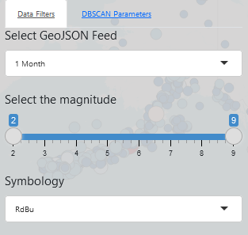
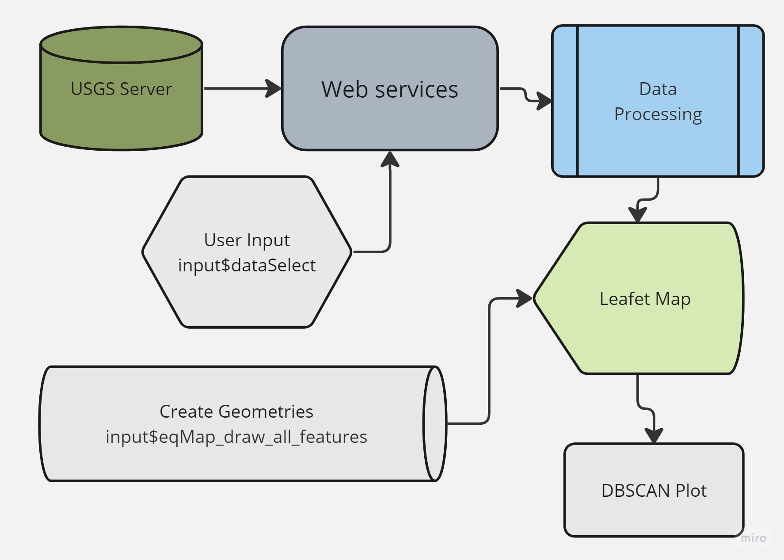
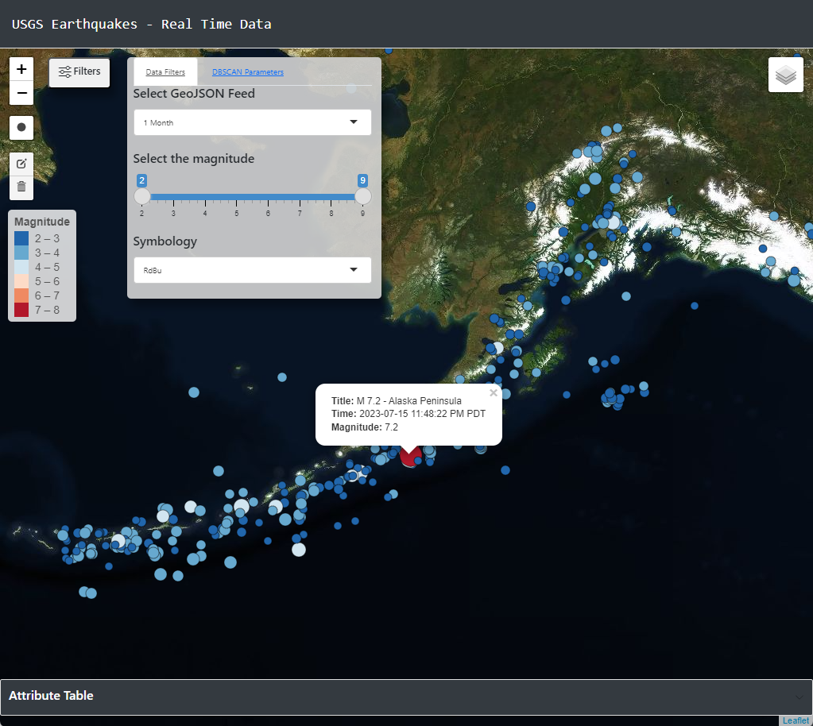
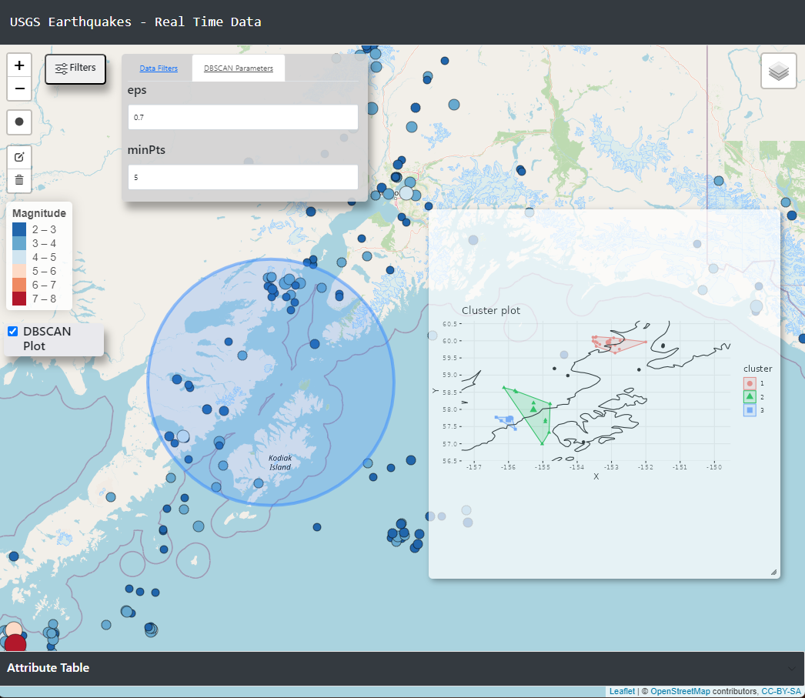

<br />

#### **Abstract**

|       Earthquakes play a pivotal role along the active tectonic boundaries of the planet, and the availability of real-time data feeds is bringing a new instantaneous approach to analysis. This study suggests the creation of an R Shiny application that takes data about earthquake locations in GeoJSON format and a series of user inputs to perform spatial clustering analysis via DBSCAN. The clustering method was selected due to its ability to handle irregularly shaped and sized clusters and its ability to detect spatial outliers. The data has a 1-minute temporal resolution and is refreshed each time the application loads. R programming packages visible in **Figure 1** will be integrated into the application to provide representation and analysis of current spatiotemporal data.There are currently a variety of web GIS (Geographical Information Systems) applications available to the public that provide point and click information and filtering to understand where and when earthquakes are happening in real time (Latest Earthquakes, n.d.). However, R Shiny applications leveraging open web mapping that are dedicated to visualizing spatial cluster analysis of real-time seismic data are lacking and this application aims to fill that gap. The interactive component of the Shiny application enables speedy consumption of current seismic events, as well as easy comparison of properties, and determining spatial clustering. The application allows for DBSCAN parameter adjustments without refreshing the plot or the browser. Future research should focus on testing the effectiveness of DBSCAN for the spatial clustering of earthquake data in this type of application and on identifying new functionalities for the app users. In short, the R Shiny application will use the R programming language's capabilities and the collaborative nature of web services to instantly assess, visualize, and identify spatial clusters of current seismic events throughout the world.

```{r,warning=FALSE,message=FALSE}
library(tidyverse) # series of packages for Data Science workflows
library(maps) # import world data
library(leaflet) # open web mapping
library(shiny) # web framework
library(DT) # DataTables
library(here) # local file directory library
library(sp) # spatial data
library(sf) # spatial data
library(rgdal) # read geojson web services
library(lubridate) # parse timestamp observations
library(shiny.telemetry) # read & store user inputs activity
library(leaflet.extras) # create geometries in the web map
library(dbscan) # density based spatial clustering tool
library(factoextra) # render the spatial clusters
library(mapboxapi) # import tiles from mapbox
library(RColorBrewer) # symbology for circle markers in leaflet
library(basemaps) # import basemaps
library(plotly) # interactive plots
library(shinyjqui) # make tables and html elements draggable and resizeable
```

**Figure 1.** R Packages used in the USGS Earthquakes - Real Time Data application. The list of packages was compiled to assist in data extraction, manipulation, visualization, and web based functionality.

<hr />

#### **Introduction**

|       Web applications allow for the distribution of information and analysis to end users in real time. In contrast, desktop-based analysis software can cause limitations and barriers to entry based on distribution hurdles and programming dependencies. This study's objective is to create an R Shiny application that makes analysis of real-time earthquake data from the USGS (US Geological Survey) accessible to a variety of users. Notably, users that interested in visualizing and identifying spatial clusters in the data. The application will use DBSCAN as the spatial clustering method, which finds clusters of points that are in close proximity based on a specified search distance (Density-based Clustering (Spatial Statistics); ArcGIS Pro \| Documentation, n.d.). It is an algorithm proven to work in practice, and in 2014, it received the SIGKDD test-of-time award (Schubert et al., 2017). Shiny was chosen due to its integration with the R programming language, and ease of deployment. Web frameworks can be time consuming on the developer's end, however R Shiny provides deployment options that can be completed and web accessible in minutes. 

<br />

##### **R Shiny Web Framework**

|       Shiny is an R package and web framework that allows you to easily create rich, interactive web apps. Shiny allows you to take your work in R and expose it via a web browser so that anyone can use it (Hadley Wickham, 2021). In Shiny, you express your server logic using reactive programming. The key idea of reactive programming is to specify a graph of dependencies so that when an input changes, all related outputs are automatically updated (Hadley Wickham, 2021). The Shiny application's interactive components allow for quick consumption of current seismic events, comparing attributes, and analyzing spatial density based on clustering.

<br />

##### **Density-based spatial clustering of applications with noise (DBSCAN)**

|       Conceptually, the idea behind density-based clustering is simple: given a set of data points, define a structure that accurately reflects the underlying density (Sander 2011). Schubert et al. (2017) refers to DBSCAN as a simple minimum density level estimation, based on a threshold for the number of neighbors, minPts, within the radius ε (with an arbitrary distance measure). They also state objects with more than minPts neighbors within this radius (including the query point) are considered to be a core point. Lastly, they conclude that the intuition of DBSCAN is to find those areas, which satisfy this minimum density, and which are separated by areas of lower density. The application in this study uses input widgets to update the the threshold for number of neighbors and radius before or after the plot is rendered. Earthquakes of interest to the end user can be selected by using the leaflet.extras draw tool available in the map. Once the points are intersected by the new geometry, the cluster plot will automatically render on the page.

#### **Data**

|       This study is incorporating three web services of real-time GeoJSON earthquake data based on last 30 days, 7 days, and 1 day. All three services are available as a user input choice in the application (the last 30 days is set as default). The data has a temporal resolution of 1 minute and is available here <https://earthquake.usgs.gov/earthquakes/feed/v1.0/geojson.php>. The web services contain the data structure visible in Figure 2. Earthquakes with a magnitude equal to and greater than 2.5 have been selected due to the significant load of features below that value. Reducing the data to a magnitude equal to and greater than 2.5 reduces the table size from \~12,000 rows to \~2000 rows. The latitude and longitude will provide location information for the clustering analysis. The level of magnitude will determine the class breaks renderer which is a style that allows you to visualize numeric ranges of data (Class Breaks \| Documentation \| ArcGIS Developers, n.d.) based on symbology. As the range of magnitude is determined by the slider inputs in the application, the class breaks will adapt to the selected scale.

<br />

```{r,warning=FALSE,message=FALSE,include=FALSE, echo=FALSE}
url_month <- "https://earthquake.usgs.gov/earthquakes/feed/v1.0/summary/2.5_month.geojson"

 earthquakes <- read_sf(url_month)
    eqsf <- st_transform(earthquakes, 4326)
    eqsf$time <- as.POSIXct(as.numeric(eqsf$time)/1000, origin = "1970-01-01", tz = "America/Los_Angeles")
    eqsf$time_formatted <- format(eqsf$time, "%Y-%m-%d %I:%M:%S %p %Z")
    eqsf_table <- eqsf %>%
      st_drop_geometry(eqsf) %>%
      select(mag, place, time_formatted)
```

```{r,warning=FALSE,message=FALSE,echo=FALSE}
#doc.type <- knitr::opts_knit$get('rmarkdown.pandoc.to')
#if (doc.type == "docx") { pander(eqsf_table) } else { kable(eqsf_table) }
#library(knitr)
#kable(eqsf_table[1:5, ], caption="USGS Earthquakes")
select_all(eqsf_table)
```

**Figure 2.** Selected Data structure of the USGS Earthquake GeoJSON web service. The main variables of focus in the study are magnitude, place, time, and geometry. Earthquake observations in the last 30 days average \~1600.

<hr />

#### **Methodology**

|       R Shiny applications are created by supplying the server and user interface (UI) components in a single R script file. The application is deployed and web accessible at https://pnwgeo.shinyapps.io/geoapp/ using shinyapps.io cloud platform.The reactive programming capabilities of the shiny library allow us to make data requests based on user input, which is then processed on the server side of our application. When the web browser loads, earthquakes in the last 30 days is the default web service that will appear on the map. Integrating Shiny with exsiting HTML is possible through the HTML template function to integrate a higher level of customization in an application, and was the preferred method for this study. An example of the code used to pass the Shiny UI elements into an HTML document is visible in Figure 4.

<br />  <br />

**Figure 3.** Data Filters tab in the USGS Earthquakes - Real Time Data application. The dropdown list under "Select GeoJSON Feed" provides options for "1 Month", "1 Week", and "1 Day" web services that will populate the map when chosen. The slider input provides options for the filtering the level of earthquake magnitude displayed in the map. Symbology options are available from the RColorBrewer library as another dropdown selection for providing the best visibilty of point data above the basemap tiles.\

<hr />

```{r, eval=FALSE}
# create User Interface (UI) 
      # navbar at the top of the screen
ui <- navbarPage("USGS Earthquakes - Real Time Data",
      # use the htmlTemplate function to pass variables into an html document
      tabPanel("panel 1", htmlTemplate("template.html",
      nav =  navlistPanel("USGS Earthquakes"),
      # render leaflet map
      map = leafletOutput("eqMap", width = "auto", height = "auto"),
      # render div and inputs for filters
      filters = tabsetPanel(type = "tabs",
                           tabPanel("Data Filters",  selectInput("dataSelect", h4("Select GeoJSON Feed"),
                                                                 choices = c("1 Month", "1 Week", "1 Day"),
                                                       selected = "1 Month"),
                           sliderInput("slider", h4("Select the magnitude"), 2, 9, value=c(2, 9)),  
                           selectInput("color_choice", h4("Symbology"), color_list, selected = "RdBu")),
                           tabPanel("DBSCAN Parameters", numericInput("eps_input", h4("eps"), 0.45, min = 0.1, max = 2, step = .01),
                            numericInput("minpts_input", h4("minPts"), 5, min = 1, max = 100, step = 1),
                           )),
      # use the uiOutput function to render when the DBSCAN function is called
      renderdbscan = uiOutput("dbovermap"),
      # toggle cluster plot off/on
      toggleplot = uiOutput("toggle"),
      # display attribute table
      timeTable = dataTableOutput("timeTable"),
))
)
```
**Figure 4.** User Interface programming in R Shiny. Layout elements are passed into variables that can be imported into an HTML document with template tags (e.g. \<div>{{ map }}\</div>). Passing objects into an HTML document increases the level of customization and access to Cacading Style Sheets (CSS). This is just one example of programming a UI with the Shiny library. Access to full source code is avaialable at https://github.com/tfjackc/R/tree/main/geoapp

<hr />

|       The initial load and user selection are put through the same steps in terms of data processing. The variable 'dataInput()' is storing the reactive function that will trigger the data processing when selected. 'filteredEqsf' is listening for changes to be made and will readily update when prompted. Once the data is extracted from the USGS web service and processed using simple features (sf), lubridate, tidyverse, and the datatable (DT) library. The sf library processes the GeoJSON data (the result of the read_sf() function) into a Simple Features DataFrame. In the sf object format the data is split into two variables 'eqsf' (used in the leaflet map) and 'eqsf_table (used in the DataTable). The timestamp variable is parsed into a human readable format for the table, and the 'eqsf' ready for visualization in the leaflet map based on the magnitude sliders, and symbology choices.

<br /> {width=400px} <br />

**Figure 5.** The data and reactive pipeline for the USGS Earthquake application receives web services from the USGS server, read into a simple features dataframe, transformed into the 4326 coordinate reference system, and rendered in a leaflet map. End users have the ability to select which web service is rendered, filter earthquakes by magnitude, and visualize density based spatial clustering by drawing new geometries over the earthquake points. 

```{r}
# USGS GeoJSON earthquake web services based on 1 month, 1 week, and 1 day
url_month <- "https://earthquake.usgs.gov/earthquakes/feed/v1.0/summary/2.5_month.geojson"
url_week <- "https://earthquake.usgs.gov/earthquakes/feed/v1.0/summary/2.5_week.geojson"
url_day <- "https://earthquake.usgs.gov/earthquakes/feed/v1.0/summary/2.5_day.geojson"

# create reactive data input - allows end user to select the web service of their choice
dataInput <- reactive({
    if (input$dataSelect != "1 Month" & input$dataSelect != "1 Week") {
      url_day
    } else if (input$dataSelect != "1 Month" & input$dataSelect != "1 Day") {
      url_week
    } else if (input$dataSelect != "1 Week" & input$dataSelect != "1 Day") {
      url_month
    }
  })
  
  # when the dataInput is selected in the dropdown tab, the reactive variable filteredEqsf is listening for change
  filteredEqsf <- reactive({
    earthquakes <- read_sf(dataInput()) # read input on selection or browser load into sf
    eqsf <- st_transform(eqsf, 4326) # transform coordinate reference system to 4326
    
    # parse timestamp into readable format
    eqsf$time <- as.POSIXct(as.numeric(eqsf$time)/1000, origin = "1970-01-01", tz = "America/Los_Angeles")
    eqsf$time_formatted <- format(eqsf$time, "%Y-%m-%d %I:%M:%S %p %Z")
    eqsf_table <- eqsf %>%
      st_drop_geometry(eqsf) %>%
      select(mag, place, time_formatted)
    
    # listen for changes on the sliders to filter visible magnitude
    filteredData <- eqsf %>%
      filter(mag >= input$slider[1] & mag <= input$slider[2])
    
    # symbology is based on magnitude
    pal <- colorBin(
      palette = input$color_choice,
      domain = filteredData$mag,
      reverse = TRUE,
      bins = 5
    )
    
    # pass global variables to use other parts of the server function
    list(filteredData = filteredData, pal = pal, eqsf_table = eqsf_table, eqsf = eqsf)
  })
```

**Figure 6.** Three different time scale web services are imported from the USGS server and put into a chain of reactive variables that will trigger when a change is detected by 'input\$dataSelect' which refers to the "Select GeoJSON Feed" visible in Figure 3. The reactive programming of the Shiny library provides a flexible user interface with the ability to easily manipulate and filter available data.

<hr />

<br />  <br />

**Figure 7.** Main page of the R Shiny USGS Earthquake - Real Time Data application with filters set to retrieve 1 month of data, and all magnitudes ranging from 2 - 9 in scale. 

<hr />

|       Once the data is loaded in the application, spatial clustering can be determined by creating a new geometry over the area of interest. The new geometry will intersect the earthquake data set and trigger the DBSCAN tool to run the dbscan::dbscan() function and display the results into an HTML element with the factoextra::fviz_cluster() function. The minimum points are set to 5 and the radius is set to 0.45 by default and can be changed before or after the new geometry triggers the DBSCAN tool. The reactive programming of the shiny application allows us to adjust the values of the DBSCAN parameters after the plot has been created without refreshing the browser.

<br />  <br />

**Figure 8.** The leaflet.extras library provides the functionality for the end user to create new geometries on the web map. Leveraging the reactive programming of Shiny, the center point and bounding box of the circle is extracted and intersects the earthquake points to provide a visualization of spatial clustering with DBSCAN. Instantaneously we can see a variety of clusters surrounding Kodiak Island in Southern Alaska. 

<hr />

```{r, eval = FALSE}
# Listens for changes with the leaflet.extras draw tool
observeEvent(input$eqMap_draw_all_features, {
# function for creating/updating the DBSCAN plot
runDBSCAN <- function(circle_geom, db, xmin, xmax, ymin, ymax, locs) { 

  # listen for updated inputs for eps and minpts value
  eps_input <- reactive(input$eps_input)
  minpts_input <- reactive(input$minpts_input)
  
  # calculate clustering result and cluster visualization
  db_result <- reactive({
    dbscan::dbscan(locs, eps = eps_input(), minPts = minpts_input())
  })
  
  # use the factoextra library for rendering clusters
  cluster_data <- reactive({
    factoextra::fviz_cluster(db_result(), 
                             locs, 
                             stand = FALSE, 
                             ellipse = TRUE, 
                             ggtheme = theme_minimal(), 
                             geom = "point")
  })
  
  # render dynamic UI (draggable and resizeable)
  output$dbovermap <- renderUI({
    jqui_draggable(
      jqui_resizable(
        plotOutput("dbscan_plot", 
                   height="480"), 
        options = list(aspectRatio = TRUE)))
  })
  
  # intersecting bounding box
  bbox <- st_bbox(circle_geom)
  ymin <- as.numeric(bbox['ymin'])
  ymax <- as.numeric(bbox['ymax'])
  xmax <- as.numeric(bbox['xmax'])
  xmin <- as.numeric(bbox['xmin'])
  
  # Render plot
  output$dbscan_plot <- renderPlot({
    
    cluster_data_plot <- cluster_data()
    
    cluster_data_plot +
      geom_map(
        data = world, map = world,
        aes(long, lat, map_id = region),
        color = "black", fill = NA
      ) +
      coord_sf(xlim = c(xmin, xmax), ylim = c(ymin, ymax))
    
  })
  
  outputOptions(output, "dbscan_plot", suspendWhenHidden = FALSE)
  
  # toggle view of the cluster plot
  output$toggle <- renderUI({
    checkboxInput("toggle_plot", h4("DBSCAN Plot"), TRUE)
  })
}
```

**Figure 9** An important code section in the USGS Earthquake application contained in the server side logic for cluster visualization. The observeEvent function listens for changes in the creation of geometries in the web map to perform spatial clustering. The function also listens to changes from the minimum points and radius inputs in the DBSCAN parameters. Reactive programming allows analysis to be performed efficiently without reloading the browser reducing load time for results. 

<hr />

|       After the application was successfully built, deployed, and spatial clustering was performed, testing of the main features of the application was conducted. The main features of the application include data filtering, symbology control, intersecting points to visualize clustering on a plot, and a draggable, and resizeable plot window. Testing was performed to insure application reliability locally and in the production environment. Time constraints limit the availability of testing the application but will be required in the future to understand the effectiveness of the application. The shiny.telemetry library is available and provides developers with the tools to help understand how users interact with Shiny dashboards. It also answer questions such as: which tabs/pages are more often visited, which inputs users are changing, what is the average length of a session (Appsilon, 2023).

#### **Conclusion**

The R shiny application leverages the capabilities of the R programming language and the shareability of web services to rapidly analyze current seismic events around the globe. The ability to update data at a 1-minute interval will facilitate dynamic inputs for the analysis and visualization.
Providing effective tools for analysis can vary based on the end user requirements. Testing the application with user feedback should be completed to find if the functionalities and analytical methods are accomplishing the goal of the study. With the source code publicly available at
https://github.com/tfjackc/R/blob/main/geoapp/app.R the project is free to reproduce and extend.

#### **Resources**

Latest Earthquakes. (n.d.). Latest Earthquakes. https://earthquake.usgs.gov/earthquakes/map/?extent=7.53676,-154.6875&extent=60.15244,-35.33203

Density-based Clustering (Spatial Statistics) ;ArcGIS Pro \| Documentation. <https://pro.arcgis.com/en/pro-app/latest/tool-reference/spatial-statistics/densitybasedclustering.htm>

Hadley Wickham. (2021). Mastering shiny. O'Reilly Media, Inc.

Shiny - Welcome to Shiny. (n.d.). Shiny - Welcome to Shiny. <https://shiny.posit.co/r/getstarted/shiny-basics/lesson1/index.html>

Class breaks \| Documentation \| ArcGIS Developers. (n.d.). Class Breaks \| Documentation \| ArcGIS Developers. <https://developers.arcgis.com/documentation/mapping-apis-and-services/visualization/data-driven-styles/class-breaks/>

Hermawati, R., & Sitanggang, I. S. (2016). Web-Based Clustering Application Using Shiny Framework and DBSCAN Algorithm for Hotspots Data in Peatland in Sumatra. Procedia Environmental Sciences, 33, 317--323. <https://doi.org/10.1016/j.proenv.2016.03.082>

Schubert, E., Sander, J., Ester, M., Kriegel, H. P., & Xu, X. (2017). DBSCAN Revisited, Revisited. ACM Transactions on Database Systems, 42(3), 1--21. <https://doi.org/10.1145/3068335>

Sander J (2011). "Density-Based Clustering." In Encyclopedia of Machine Learning, pp. 270--273. Springer-Verlag.

Appsilon. (2023, June 1). GitHub - Appsilon/shiny.telemetry: Easy logging of users activity and session
events of your Shiny App. GitHub. https://github.com/Appsilon/shiny.telemetry


